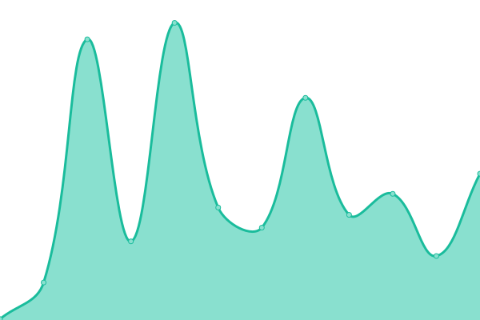
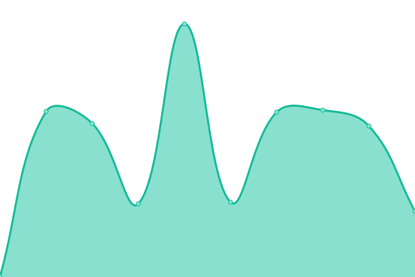

# [📈 Live Status](https://status.diygod.me): <!--live status--> **🟩 All systems operational**

This repository contains the open-source uptime monitor and status page for [DIYgodLab](https://status.diygod.me), powered by [Upptime](https://github.com/upptime/upptime).

With [Upptime](https://upptime.js.org), you can get your own unlimited and free uptime monitor and status page, powered entirely by a GitHub repository. We use [Issues](https://github.com/DIYgodLab/upptime/issues) as incident reports, [Actions](https://github.com/DIYgodLab/upptime/actions) as uptime monitors, and [Pages](https://status.diygod.me) for the status page.

<!--start: status pages-->
<!-- This summary is generated by Upptime (https://github.com/upptime/upptime) -->
<!-- Do not edit this manually, your changes will be overwritten -->
<!-- prettier-ignore -->
| URL | Status | History | Response Time | Uptime |
| --- | ------ | ------- | ------------- | ------ |
|  [Public - xLog](https://xlog.app) | 🟩 Up | [public-x-log.yml](https://github.com/DIYgodLab/upptime/commits/HEAD/history/public-x-log.yml) | 

 673ms
     
 | 

<a href="https://status.diygod.me/history/public-x-log">100.00%</a>
    

|  [Public - RSSHub](https://rsshub.app) | 🟩 Up | [public-rss-hub.yml](https://github.com/DIYgodLab/upptime/commits/HEAD/history/public-rss-hub.yml) | 

 175ms
     
 | 

<a href="https://status.diygod.me/history/public-rss-hub">100.00%</a>
    

|  [Public - RSSHub Docs](https://docs.rsshub.app) | 🟩 Up | [public-rss-hub-docs.yml](https://github.com/DIYgodLab/upptime/commits/HEAD/history/public-rss-hub-docs.yml) | 

 145ms
     
 | 

<a href="https://status.diygod.me/history/public-rss-hub-docs">100.00%</a>
    

|  [Public - DPlayer Docs](https://dplayer.diygod.dev) | 🟩 Up | [public-d-player-docs.yml](https://github.com/DIYgodLab/upptime/commits/HEAD/history/public-d-player-docs.yml) | 

 158ms
     
 | 

<a href="https://status.diygod.me/history/public-d-player-docs">100.00%</a>
    

|  [Public - APlayer Docs](https://aplayer.js.org) | 🟩 Up | [public-a-player-docs.yml](https://github.com/DIYgodLab/upptime/commits/HEAD/history/public-a-player-docs.yml) | 

 146ms
     
 | 

<a href="https://status.diygod.me/history/public-a-player-docs">100.00%</a>
    

|  [Personal - Blog](https://diygod.cc) | 🟩 Up | [personal-blog.yml](https://github.com/DIYgodLab/upptime/commits/HEAD/history/personal-blog.yml) | 

 894ms
     
 | 

<a href="https://status.diygod.me/history/personal-blog">100.00%</a>
    

|  [Personal - Archived Blog](https://archive.diygod.me) | 🟩 Up | [personal-archived-blog.yml](https://github.com/DIYgodLab/upptime/commits/HEAD/history/personal-archived-blog.yml) | 

 125ms
     
 | 

<a href="https://status.diygod.me/history/personal-archived-blog">100.00%</a>
    

|  Personal - Docker | 🟩 Up | [personal-docker.yml](https://github.com/DIYgodLab/upptime/commits/HEAD/history/personal-docker.yml) | 

 772ms
     
 | 

<a href="https://status.diygod.me/history/personal-docker">100.00%</a>
    

|  Personal - Fog Machine | 🟩 Up | [personal-fog-machine.yml](https://github.com/DIYgodLab/upptime/commits/HEAD/history/personal-fog-machine.yml) | 

 332ms
     
 | 

<a href="https://status.diygod.me/history/personal-fog-machine">100.00%</a>
    

|  Personal - Miniflux | 🟩 Up | [personal-miniflux.yml](https://github.com/DIYgodLab/upptime/commits/HEAD/history/personal-miniflux.yml) | 

 706ms
     
 | 

<a href="https://status.diygod.me/history/personal-miniflux">100.00%</a>
    

|  Personal - n8n | 🟩 Up | [personal-n8n.yml](https://github.com/DIYgodLab/upptime/commits/HEAD/history/personal-n8n.yml) | 

 730ms
     
 | 

<a href="https://status.diygod.me/history/personal-n8n">100.00%</a>
    

|  Personal - NAS | 🟩 Up | [personal-nas.yml](https://github.com/DIYgodLab/upptime/commits/HEAD/history/personal-nas.yml) | 

 440ms
     
 | 

<a href="https://status.diygod.me/history/personal-nas">100.00%</a>
    

|  [Personal - NAS Status](https://nas-status.diygod.me) | 🟩 Up | [personal-nas-status.yml](https://github.com/DIYgodLab/upptime/commits/HEAD/history/personal-nas-status.yml) | 

 4282ms
     
 | 

<a href="https://status.diygod.me/history/personal-nas-status">98.66%</a>
    

|  Personal - RSSHub | 🟩 Up | [personal-rss-hub.yml](https://github.com/DIYgodLab/upptime/commits/HEAD/history/personal-rss-hub.yml) | 

 678ms
     
 | 

<a href="https://status.diygod.me/history/personal-rss-hub">100.00%</a>
    

|  Personal - Umami | 🟩 Up | [personal-umami.yml](https://github.com/DIYgodLab/upptime/commits/HEAD/history/personal-umami.yml) | 

 722ms
     
 | 

<a href="https://status.diygod.me/history/personal-umami">100.00%</a>
    

|  [Personal - Suannai](https://suannai.cat) | 🟩 Up | [personal-suannai.yml](https://github.com/DIYgodLab/upptime/commits/HEAD/history/personal-suannai.yml) | 

 428ms
     
 | 

<a href="https://status.diygod.me/history/personal-suannai">100.00%</a>
    

|  [Personal - Pal](https://pal.diygod.me) | 🟩 Up | [personal-pal.yml](https://github.com/DIYgodLab/upptime/commits/HEAD/history/personal-pal.yml) | 

 766ms
     
 | 

<a href="https://status.diygod.me/history/personal-pal">100.00%</a>
    

<!--end: status pages-->

[**Visit our status website →**](https://status.diygod.me)

## 📄 License

- Powered by: [Upptime](https://github.com/upptime/upptime)
- Code: [MIT](./LICENSE) © [Anand Chowdhary](https://anandchowdhary.com), supported by [Pabio](https://pabio.com)
- Data in the `./history` directory: [Open Database License](https://opendatacommons.org/licenses/odbl/1-0/)
